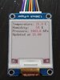
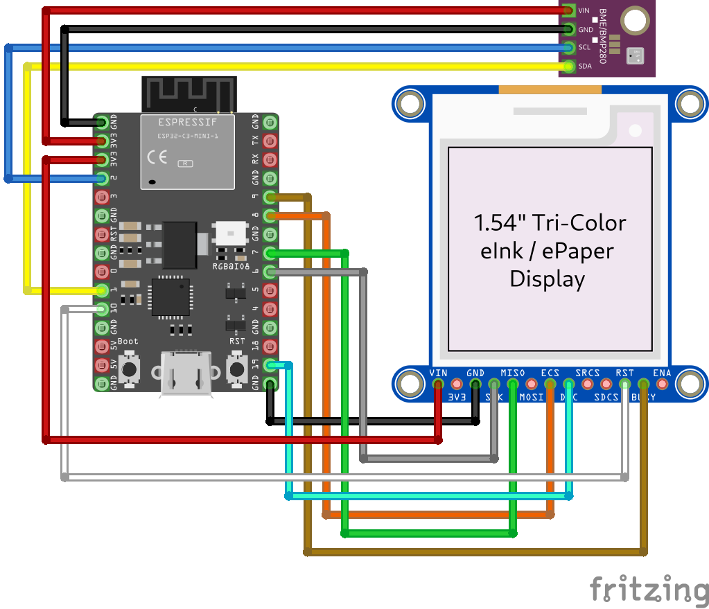

ESP32-C3 Embassy
====

A Rust async firmware for ESP32-C3 for reading and displaying sensor values using Embassy

<https://gitlab.com/claudiomattera/esp32c3-embassy>

The firmware runs on a [ESP32-C3] microcontroller, samples environment data (temperature, humidity, pressure) from a [BME280] sensor over I²C, and displays the latest sample on a [WaveShare 1.54 inches model B version 2] E-INK display over SPI.

[ESP32-C3]: https://www.espressif.com/en/products/socs/esp32-c3
[BME280]: https://www.bosch-sensortec.com/products/environmental-sensors/humidity-sensors-bme280/
[WaveShare 1.54 inches model B version 2]: https://www.waveshare.com/product/1.54inch-e-paper-module-b.htm

In particular:

* It uses [Embassy][embassy] as a general framework, and makes everything async, including communicating with sensor and display over I²C and SPI with [`embedded-hal-async`][embedded-hal-async].
* It is implemented on bare metal with `no_std`, but with `alloc` (it is required for WiFi).
* It is up-to-date with the latest crate versions (as of 2024-11-03).
* It uses [`reqwless`][reqwless] for HTTP requests and TLS.

It is mostly meant as a reference / example / starting point.
The Rust + ESP32 + Embassy ecosystem is still very young, and I had a hard time putting everything together to make a complete application.
Hopefully this project will be useful to other beginners :)

[embassy]: https://embassy.dev/
[embedded-hal-async]: https://crates.io/crates/embedded-hal-async
[reqwless]: https://crates.io/crates/reqwless

Architecture
----

The firmware uses Embassy.

It starts by loading the current time from RTC Fast memory.
If it is zero (as Unix timestamp), it means the clock has not been synchronized yet.
So it connects to the WiFi network, and by making an HTTPS request to [WorldTimeAPI] to get the current time and time offset.
This might be changed to use SNTP in the future, though that does not provide information about the time offset.
Then it disconnects from the WiFi network (this is required to be able to enter deep sleep later).

After that, it creates structures for asynchronous I²C and SPI buses, a channel, and spawns two tasks with Embassy.

One task creates an interface the the BME280 sensor, then periodically reads a sample from it, and sends it through the channel.
The other task creates an interface to the WaveShare E-INK display, then listens to the channel.
Whenever a new sample arrives, it prints it on the display.

Meanwhile, the main task is sleeping for a longish amount of time.
After that, it saves the current time (plus the expected sleep duration) to RTC Fast memory, and it puts the module to deep sleep.

The next time the module boots, it starts from the beginning.
The clock will be initialized from RTC Fast memory, so the module will not connect to WiFi.

The architecture is more complex than it could be.
There is no actual reason for spawning tasks and using channels to communicate with them.
Or perhaps there is no actual reason for using the RTC Fast memory and deep sleep.
Or even for using asynchronous I²C and SPI interface.
And definitely there is no actual reason for using a TLS layer and connecting over HTTPS rather than HTTP.
However, as mentioned earlier, this application is meant as a reference / example / starting point for more complex projects.

[WorldTimeAPI]: https://worldtimeapi.org/

Connections
----

The sensor and the display must be connected to the correct PINs on the ESP32-C3 module.

For I²C (sensor):

* SDA -> GPIO1
* SCL -> GPIO2
* VIN/VCC -> 3.3v
* GND -> GND

For SPI (display:)

* SCK/SCLK/CLK -> GPIO6
* DIN -> GPIO7 (MOSI)
* CS -> GPIO8
* BUSY -> GPIO9
* RST -> GPIO10
* DC -> GPIO19
* VIN/VCC -> 3.3v
* GND -> GND

Usage with Nix
----

To get a development shell with the correct rust tooling, run:

~~~~shell
nix develop
~~~~

To simplify your nix workflow, you can use `direnv`

~~~~shell
echo "use flake" > .envrc
direnv allow
~~~~

Then either build as you would normally, with `just` and `cargo`:

~~~~shell
just build
~~~~

Alternatively you can build with nix:

~~~~shell
nix build
~~~~

Changes
----

See the [Changelog](./CHANGELOG.md) for a list of changes.

Development
----

See the [Contributing Guide](./CONTRIBUTING.md) for more information about development.

License
----

Copyright Claudio Mattera 2024

### Main Firmware

You are free to copy, modify, and distribute this firmware with attribution under the terms of the MPL 2.0 license ([`LICENSE-MPL-2.0.md`](./LICENSE-MPL-2.0.md) or <https://opensource.org/licenses/MPL-2.0>).

### Display Driver

You are free to copy, modify, and distribute this driver with attribution under the terms of either

*   Apache License, Version 2.0
    (file [`LICENSE-APACHE-2.0.txt`](./LICENSE-APACHE-2.0.txt) or <https://opensource.org/licenses/Apache-2.0>)
*   MIT license
    (file [`LICENSE-MIT.txt`](./LICENSE-MIT.txt) or <https://opensource.org/licenses/MIT>)

at your option.
